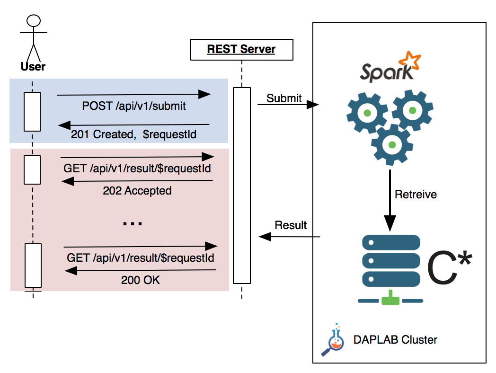

This page details the API accepting requests for the SwissSimilarities database.

The API is globally available at [https://swisssim.daplab.ch](https://swisssim.daplab.ch)

**General Principle**

As the processing associated to requests might take some time before completion, which might lead to timeouts
somewhere in the request chain, the API is split in two parts:

1. Submitting a search request via a POST call,
2. Polling to retrieve the result via a GET

The following flow diagram shows a typical interaction with the server: the request is submitted first, the server
returns a HTTP status code `201 Created` along with a [UUID](https://en.wikipedia.org/wiki/Universally_unique_identifier)
referencing the request ID, which has be be used in all the subsequent API calls. 
The user will the start polling the server. HTTP status code `202 Accepted` is returned by the server until
the request is complet. Then a `200 OK` is used.



The next section details the API, including the parameters exchanged with the server.

# Submit a job

```
POST /api/v1/submit
```

The payload of the POST is JSON encoded, containing the attributes shown in the table below:

| Parameter   | Type   | Mandatory | Value |
| ----------- | ------ |---------- | ----- |
| fingerprint | String | yes       | hex encoded, 128 bytes molecule fingerprint. See the example below |
| limit       | Number | no        | number of matches to return, default 400, max 1000 |
| threshold   | Number | no        | smiliarity threshold. Molecules below this threshold will not be returned, even if in the limit. Default 0.8, min 0.5 |

An example of payload would be: 

```
{ 
   "fingerprint": "hex encoded, 128 bytes molecule fingerprint"
   "limit": 400
   "threshold": 0.8
}
```

If the request is properly formatted, the server returns a HTTP status `201 Created`. The header will also contains
the location at which the job can be polled, as well as a JSON object containting the requestId:

```
Location: /api/v1/result/$REQUEST_UUID

{
   "requestId": "$REQUEST_UUID"
}
```


For instance

```
POST /api/v1/submit

{ 
   "fingerprint": "hex encoded, 128 bytes molecule fingerprint"
   "retrieve": 400
   "threshold": 0.8
}

Returns 201 Created
...
Location: /api/v1/result/4d8de004-29e9-499d-9b81-a329d454040e
{
   "requestId": "4d8de004-29e9-499d-9b81-a329d454040e"
}
```

Malformed requests, as well as requests missing the mandatory parameter(s) 
will return a HTTP status `400 Bad Request`.


# Retrieve the results

Retrieving the results might be composed of several calls. As long as the result is not ready, the call returns
a HTTP status `202 Accepted`. Once the result is ready, `200 OK` is returned along with the result itself
JSON encoded. The result is an array (sorted sequence) of molecules matching the request,
sorted by top similarity descendant. The exact format of the result is detailled below.

## Processing not completed

```
GET /api/v1/result/$requestId

202 Accepted
```

## Processing completed

```
GET /api/v1/result/$requestId

20O OK

[ 
  {
    "fingerprint": "...",
    "smile": "..."
    "similarity": 0.9999,
    "details": {
      "name": ...
    }
  },
  {
    ...
  },
  ...
]     
```

| Parameter    | Type   | Mandatory | Value |
| ------------ | ------ |---------- | ----- |
| fingerprint  | String | yes       |  |
| smile        | String | yes       |  |
| similarity   | Number | yes       |  |
| details      | Object | yes       |  |
| details.name | String | yes       |  |

## Result TTL

The result is kept 4 hours before it is discarded. If you're not retrieving the data during this time laps, 
the data is lost.

Subsequent retrieve call will consistently return `404 Not Found`.
